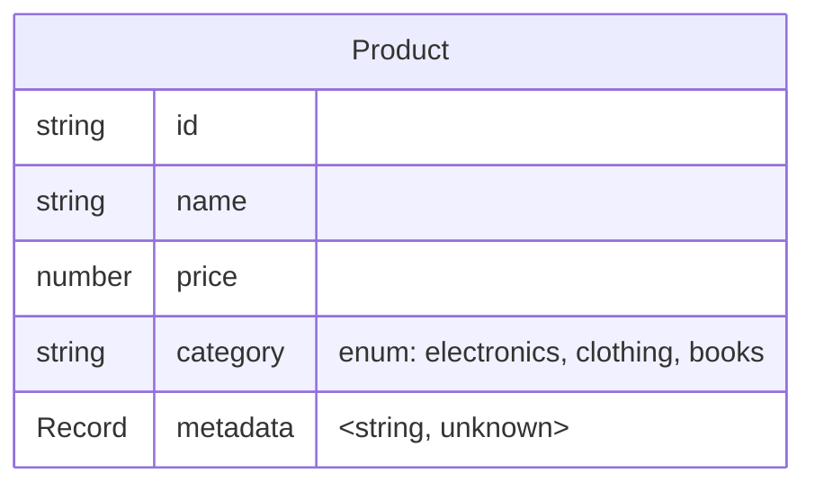
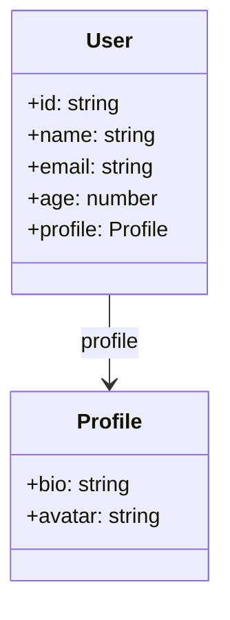
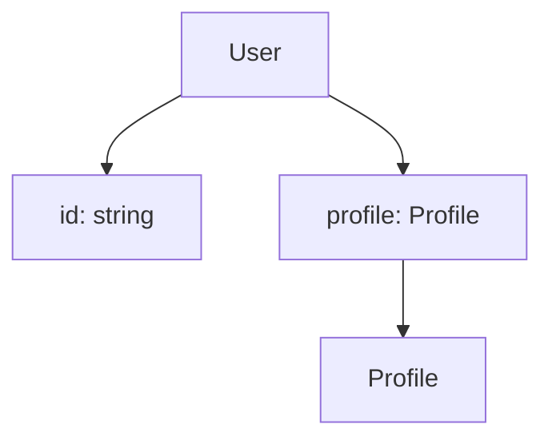
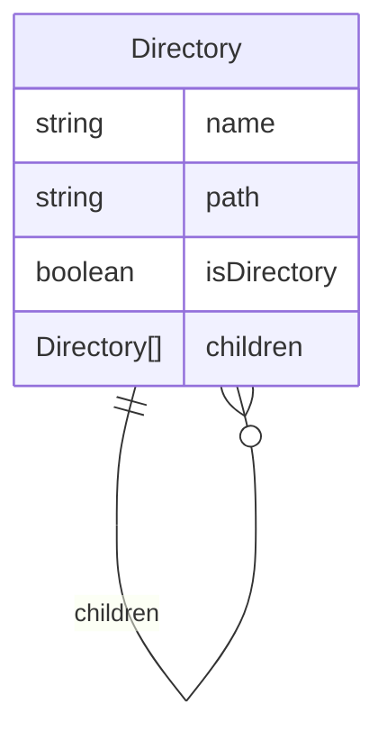
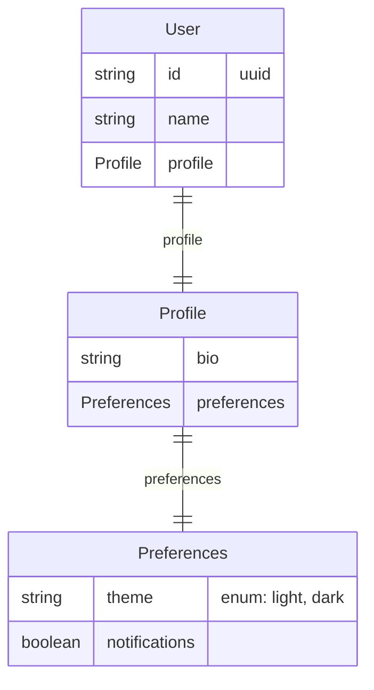
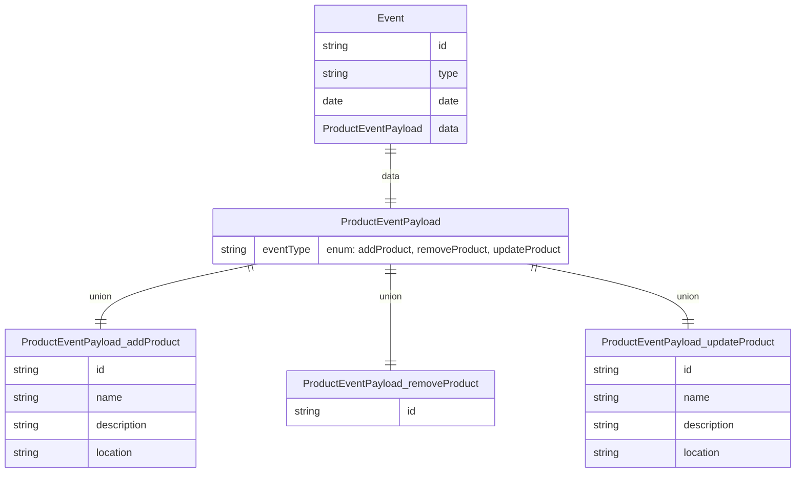
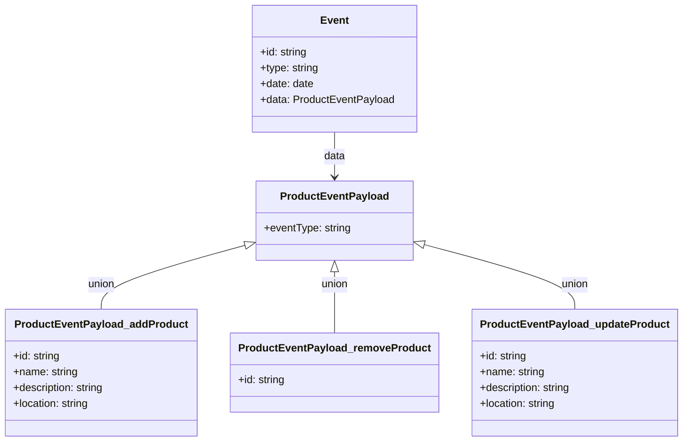

# Zod Mermaid

[](https://github.com/kothar/zod-mermaid/actions/workflows/ci.yml)

A TypeScript library that generates Mermaid diagrams from Zod schemas. Create beautiful Entity-Relationship, Class, and Flowchart diagrams from your Zod schema definitions.

## Features

- **Multiple Diagram Types**: Generate ER, Class, and Flowchart diagrams
- **Nested Object Support**: Automatically creates separate entities for nested objects
- **Discriminated Union Support**: Handles complex union types with separate entities for each variant
- **Self-Referential Types**: Handles recursive schemas with lazy types
- **Validation Display**: Shows field constraints and validation rules
- **Record Type Support**: Displays record types with generic parameters
- **Custom Entity Names**: Specify custom names for top-level entities
- **Optional Field Handling**: Properly represents optional fields and relationships

## AI-Generated Code

This repository was primarily generated using AI (Claude Sonnet). 
Human review was applied to ensure correctness and relevance.
Contributions welcome!

## Installation

```bash
npm install zod-mermaid
```

## Quick Start

```typescript
import { z } from 'zod';
import { generateMermaidDiagram } from 'zod-mermaid';

const UserSchema = z.object({
  id: z.uuid(),
  name: z.string().min(1).max(100),
  email: z.email(),
  age: z.number().min(0).max(120),
  profile: z.object({
    bio: z.string().optional(),
    avatar: z.url().optional(),
  }),
});

// Generate different diagram types
const erDiagram = generateMermaidDiagram(UserSchema, { 
  diagramType: 'er', 
  entityName: 'User' 
});

const classDiagram = generateMermaidDiagram(UserSchema, { 
  diagramType: 'class', 
  entityName: 'User' 
});

const flowchartDiagram = generateMermaidDiagram(UserSchema, { 
  diagramType: 'flowchart', 
  entityName: 'User' 
});
```

## Diagram Types

### Entity-Relationship Diagrams

Shows entities, their attributes, and relationships with validation constraints.

```typescript
const ProductSchema = z.object({
  id: z.string(),
  name: z.string(),
  price: z.number().positive(),
  category: z.enum(['electronics', 'clothing', 'books']),
  metadata: z.record(z.string(), z.unknown()),
});

const diagram = generateMermaidDiagram(ProductSchema, { 
  diagramType: 'er', 
  entityName: 'Product' 
});
```

**Output:**


### Class Diagrams

Displays classes with their properties and associations.

```typescript
const diagram = generateMermaidDiagram(UserSchema, { 
  diagramType: 'class', 
  entityName: 'User' 
});
```

**Output:**


### Flowchart Diagrams

Shows hierarchical structure with field details and entity connections.

```typescript
const diagram = generateMermaidDiagram(UserSchema, { 
  diagramType: 'flowchart', 
  entityName: 'User' 
});
```

**Output:**


## Advanced Features

### Self-Referential Schemas

Handle recursive data structures like directory listings:

```typescript
const DirectorySchema = z.object({
  name: z.string(),
  path: z.string(),
  isDirectory: z.boolean(),
  children: z.array(z.lazy(() => DirectorySchema)).optional(),
});

const diagram = generateMermaidDiagram(DirectorySchema, { 
  diagramType: 'er', 
  entityName: 'Directory' 
});
```

**Output:**


### Nested Object Relationships

Automatically creates separate entities for nested objects:

```typescript
const UserSchema = z.object({
  id: z.uuid(),
  name: z.string(),
  profile: z.object({
    bio: z.string(),
    preferences: z.object({
      theme: z.enum(['light', 'dark']),
      notifications: z.boolean(),
    }),
  }),
});
```

**Output:**


### Discriminated Unions

Handle complex event systems and API responses with discriminated unions:

```typescript
const ProductEventPayloadSchema = z.discriminatedUnion('eventType', [
  z.object({
    eventType: z.literal('addProduct'),
    id: z.uuid(),
    name: z.string(),
    description: z.string(),
    location: z.string(),
  }).describe('AddProductEvent'),
  z.object({
    eventType: z.literal('removeProduct'),
    id: z.uuid(),
  }).describe('RemoveProductEvent'),
  z.object({
    eventType: z.literal('updateProduct'),
    id: z.uuid(),
    name: z.string(),
    description: z.string(),
    location: z.string(),
  }).describe('UpdateProductEvent'),
]).describe('ProductEventPayload');

const EventSchema = z.object({
  id: z.string(),
  type: z.literal('com.example.event.product'),
  date: z.date(),
  data: ProductEventPayloadSchema,
}).describe('Event');
```

**ER Diagram Output:**


**Class Diagram Output:**


**Note:** Use `.describe()` on your discriminated union and its members to provide meaningful entity names in the diagrams. The library automatically creates separate entities for each union member using their descriptions and shows the relationships between them with the discriminator values as edge labels.

## Configuration Options

```typescript
interface MermaidOptions {
  diagramType?: 'er' | 'class' | 'flowchart';
  entityName?: string;
  includeValidation?: boolean;
  includeOptional?: boolean;
}
```

- **`diagramType`**: Choose between 'er', 'class', or 'flowchart'
- **`entityName`**: Custom name for the top-level entity
- **`includeValidation`**: Show field constraints and validation rules
- **`includeOptional`**: Display optional field indicators

## Examples

See the [examples/mermaid-examples.md](examples/mermaid-examples.md) file for comprehensive examples of all diagram types and features.

## Development

### Setup

```bash
npm install
npm run build
npm test
```

### Available Scripts

- `npm run build` - Build the project
- `npm run test` - Run tests
- `npm run lint` - Run ESLint
- `npm run format` - Format code with Prettier

## License

MIT 