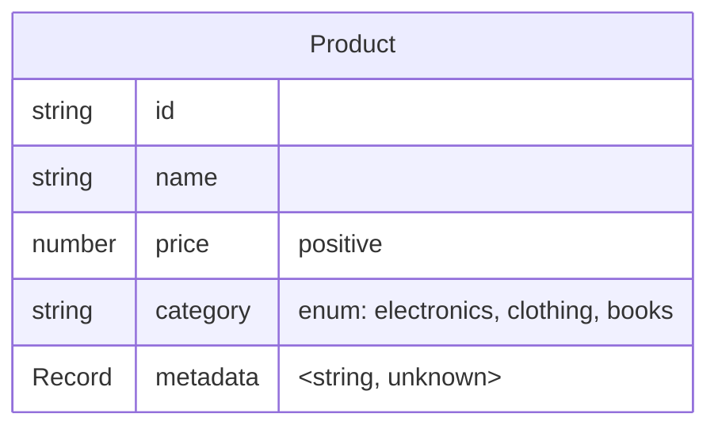
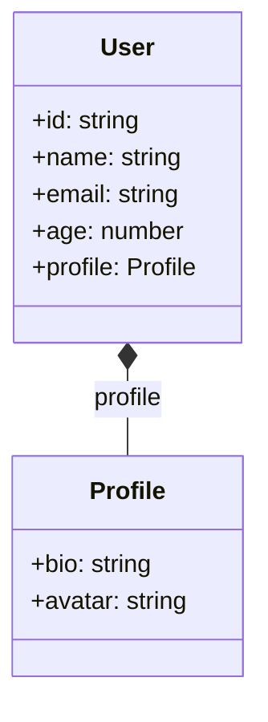
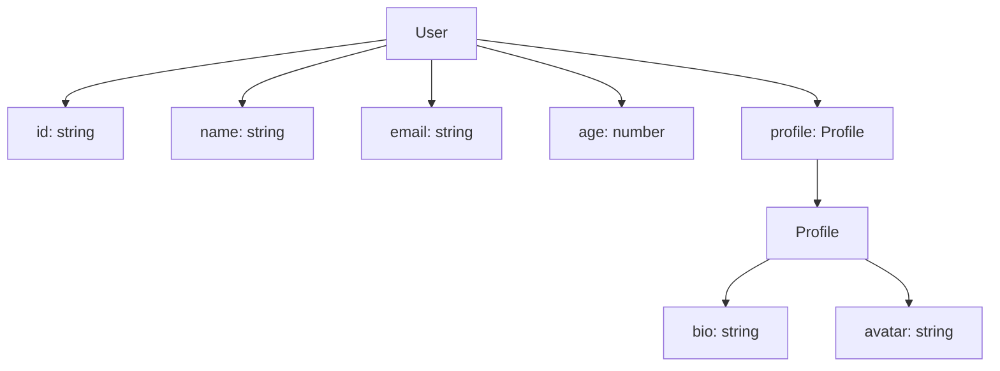
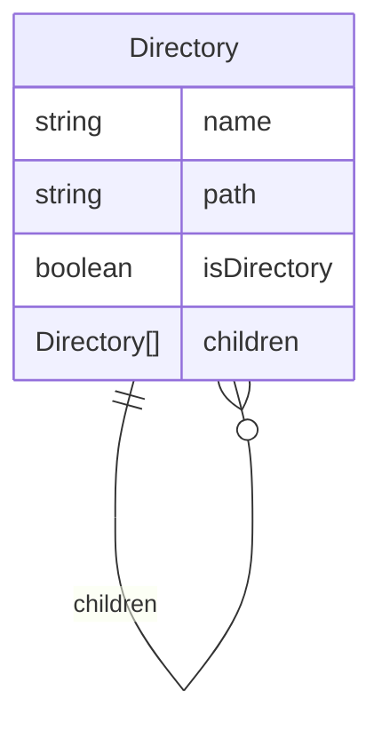
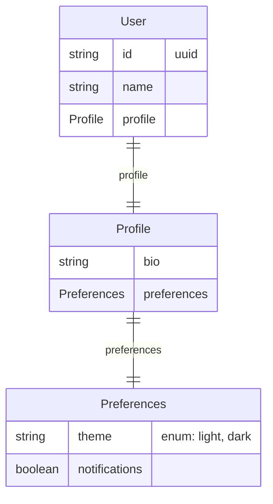
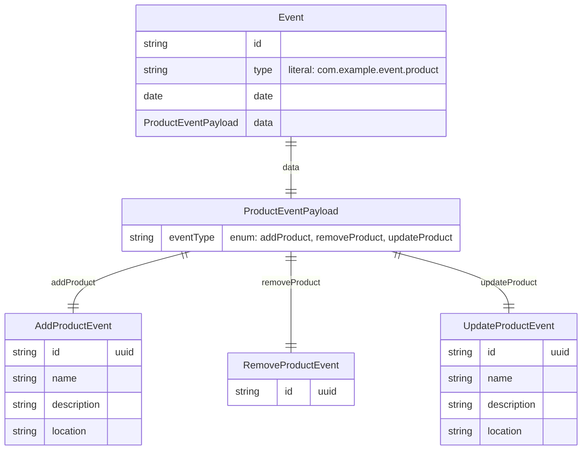
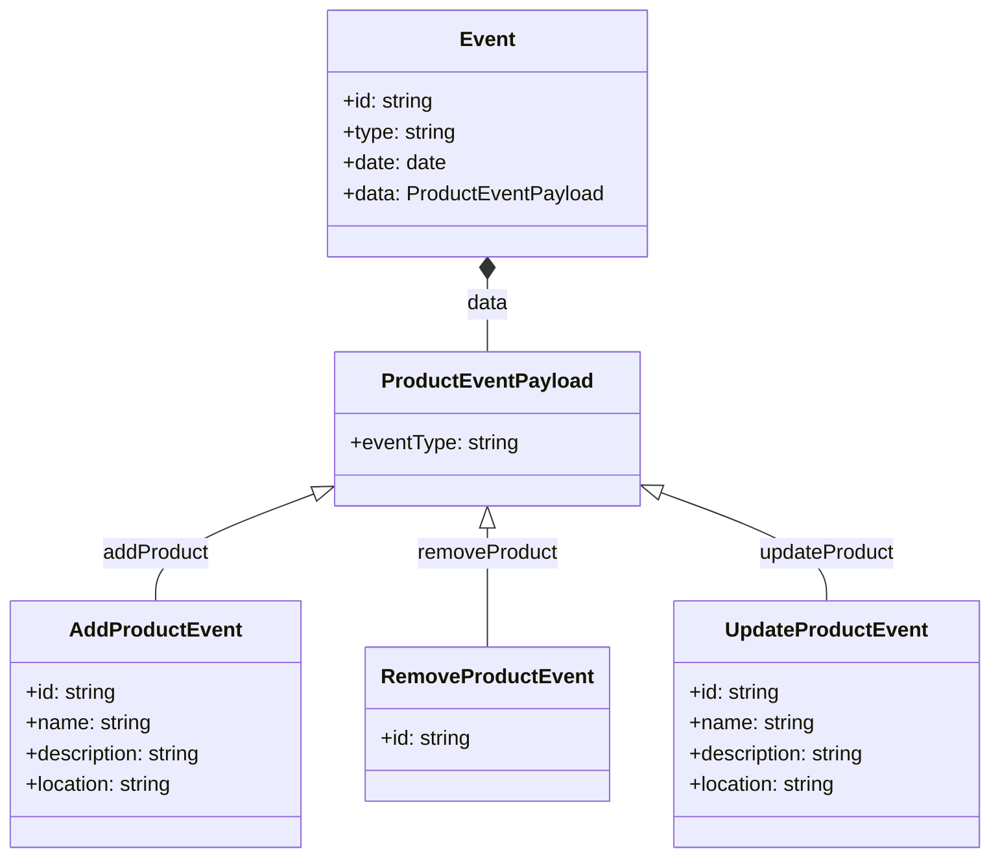
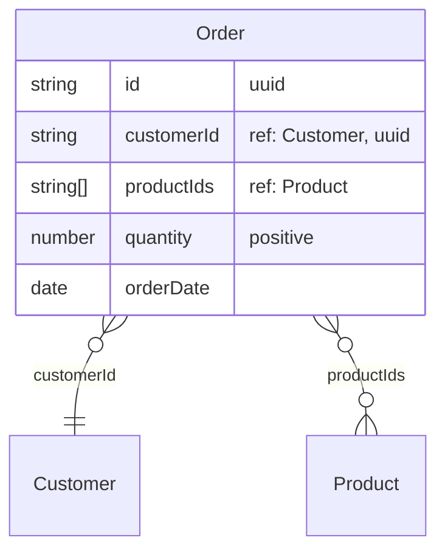
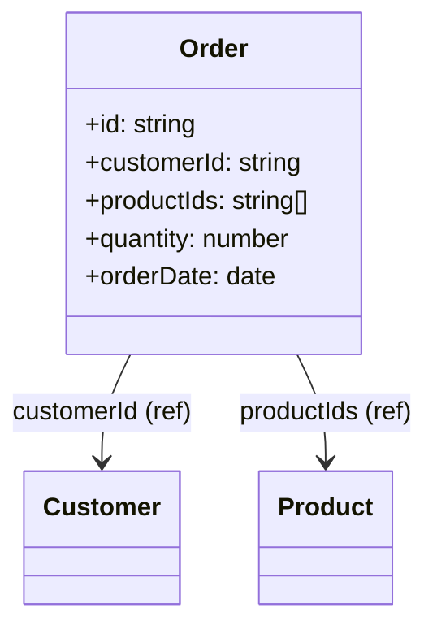
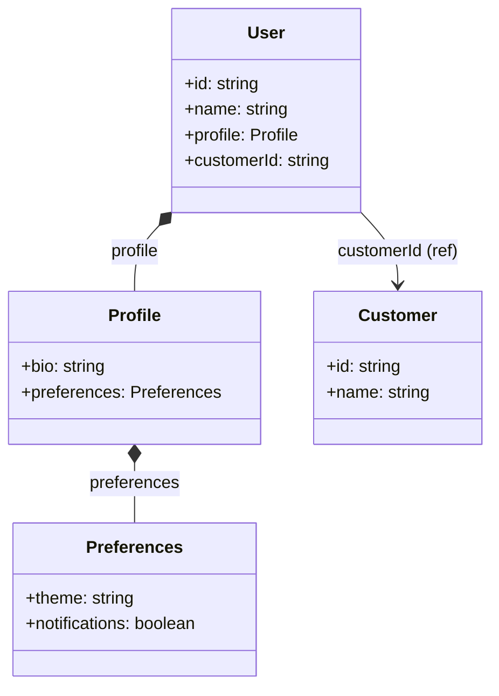

# Zod Mermaid

[](https://github.com/kothar/zod-mermaid/actions/workflows/ci.yml)

A TypeScript library that generates Mermaid diagrams from Zod schemas. Create beautiful Entity-Relationship, Class, and Flowchart diagrams from your Zod schema definitions.

## Features

- **Multiple Diagram Types**: Generate ER, Class, and Flowchart diagrams
- **Nested Object Support**: Automatically creates separate entities for nested objects
- **Discriminated Union Support**: Handles complex union types with separate entities for each variant
- **Self-Referential Types**: Handles recursive schemas with lazy types
- **ID References**: Create relationships between entities using ID references with proper cardinality
- **Validation Display**: Shows field constraints and validation rules
- **Record Type Support**: Displays record types with generic parameters
- **Custom Entity Names**: Specify custom names for top-level entities
- **Optional Field Handling**: Properly represents optional fields and relationships

## AI-Generated Code

This repository was primarily generated using AI (Claude Sonnet). 
Human review was applied to ensure correctness and relevance.
Contributions welcome!

## Installation

```bash
npm install zod-mermaid
```

## Quick Start

```typescript
import { z } from 'zod';
import { generateMermaidDiagram, idRef } from 'zod-mermaid';

const UserSchema = z.object({
  id: z.uuid(),
  name: z.string().min(1).max(100),
  email: z.email(),
  age: z.number().min(0).max(120),
  profile: z.object({
    bio: z.string().optional(),
    avatar: z.url().optional(),
  }),
});

// Generate different diagram types
const erDiagram = generateMermaidDiagram(UserSchema, { 
  diagramType: 'er', 
  entityName: 'User' 
});

const classDiagram = generateMermaidDiagram(UserSchema, { 
  diagramType: 'class', 
  entityName: 'User' 
});

const flowchartDiagram = generateMermaidDiagram(UserSchema, { 
  diagramType: 'flowchart', 
  entityName: 'User' 
});
```

### Multiple Schemas

You can also generate diagrams from multiple schemas at once by passing an array:

```typescript
const UserSchema = z.object({
  id: z.uuid(),
  name: z.string(),
  email: z.email(),
}).describe('User');

const ProductSchema = z.object({
  id: z.uuid(),
  name: z.string(),
  price: z.number().positive(),
  category: z.enum(['electronics', 'clothing', 'books']),
}).describe('Product');

const OrderSchema = z.object({
  id: z.uuid(),
  customerId: idRef(UserSchema),
  productId: idRef(ProductSchema),
  quantity: z.number().positive(),
  orderDate: z.date(),
}).describe('Order');

// Generate diagram from multiple schemas
const diagram = generateMermaidDiagram([UserSchema, ProductSchema, OrderSchema], { 
  diagramType: 'er' 
});
```

This will generate a single diagram containing all entities and their relationships from all the provided schemas.

## Diagram Types

### Entity-Relationship Diagrams

Shows entities, their attributes, and relationships with validation constraints.

<!-- SCHEMA: product START -->
```typescript
const ProductSchema = z.object({
  id: z.string(),
  name: z.string(),
  price: z.number().positive(),
  category: z.enum(['electronics', 'clothing', 'books']),
  metadata: z.record(z.string(), z.unknown()),
}).describe('Product');

const diagram = generateMermaidDiagram(ProductSchema, { 
  diagramType: 'er', 
  entityName: 'Product' 
});
```
<!-- SCHEMA: product END -->

<!-- DIAGRAM: product-er START -->
**Output:**

<!-- DIAGRAM: product-er END -->

### Class Diagrams

Displays classes with their properties and associations.

```typescript
const diagram = generateMermaidDiagram(UserSchema, { 
  diagramType: 'class', 
  entityName: 'User' 
});
```

<!-- DIAGRAM: user-class START -->
**Output:**

<!-- DIAGRAM: user-class END -->

### Flowchart Diagrams

Shows hierarchical structure with field details and entity connections.

```typescript
const diagram = generateMermaidDiagram(UserSchema, { 
  diagramType: 'flowchart', 
  entityName: 'User' 
});
```

<!-- DIAGRAM: user-flowchart START -->
**Output:**

<!-- DIAGRAM: user-flowchart END -->

## Advanced Features

### Self-Referential Schemas

Handle recursive data structures like directory listings:

<!-- SCHEMA: directory START -->
```typescript
const DirectorySchema = z.object({
  name: z.string(),
  path: z.string(),
  isDirectory: z.boolean(),
  children: z.array(z.lazy(() => DirectorySchema)).optional(),
});

const diagram = generateMermaidDiagram(DirectorySchema, { 
  diagramType: 'er', 
  entityName: 'Directory' 
});
```
<!-- SCHEMA: directory END -->

<!-- DIAGRAM: directory-er START -->
**Output:**

<!-- DIAGRAM: directory-er END -->

### Nested Object Relationships

Automatically creates separate entities for nested objects:

<!-- SCHEMA: nested-user START -->
```typescript
const UserSchema = z.object({
  id: z.uuid(),
  name: z.string(),
  profile: z.object({
    bio: z.string(),
    preferences: z.object({
      theme: z.enum(['light', 'dark']),
      notifications: z.boolean(),
    }),
  }),
});
```
<!-- SCHEMA: nested-user END -->

<!-- DIAGRAM: nested-user-er START -->
**Output:**

<!-- DIAGRAM: nested-user-er END -->

### Discriminated Unions

Handle complex event systems and API responses with discriminated unions:

<!-- SCHEMA: event START -->
```typescript
const ProductEventPayloadSchema = z.discriminatedUnion('eventType', [
  z.object({
    eventType: z.literal('addProduct'),
    id: z.uuid(),
    name: z.string(),
    description: z.string(),
    location: z.string(),
  }).describe('AddProductEvent'),
  z.object({
    eventType: z.literal('removeProduct'),
    id: z.uuid(),
  }).describe('RemoveProductEvent'),
  z.object({
    eventType: z.literal('updateProduct'),
    id: z.uuid(),
    name: z.string(),
    description: z.string(),
    location: z.string(),
  }).describe('UpdateProductEvent'),
]).describe('ProductEventPayload');

const EventSchema = z.object({
  id: z.string(),
  type: z.literal('com.example.event.product'),
  date: z.date(),
  data: ProductEventPayloadSchema,
}).describe('Event');
```
<!-- SCHEMA: event END -->

<!-- DIAGRAM: event-er START -->
**ER Diagram Output:**

<!-- DIAGRAM: event-er END -->

<!-- DIAGRAM: event-class START -->
**Class Diagram Output:**

<!-- DIAGRAM: event-class END -->

**Note:** Use `.describe()` or `.meta({title})` on your discriminated union and its members to provide meaningful entity names in the diagrams. The library automatically creates separate entities for each union member using their descriptions and shows the relationships between them with the discriminator field values as edge labels.

### ID References

For cases where you want to reference other entities by ID without embedding their full structure, use the `idRef()` function. The function takes a Zod schema as an argument and extracts the ID field type and validation:

<!-- SCHEMA: order START -->
```typescript
const CustomerSchema = z.object({
  id: z.uuid(),
  name: z.string(),
  email: z.email(),
}).describe('Customer');

const OrderSchema = z.object({
  id: z.uuid(),
  customerId: idRef(CustomerSchema), // References Customer entity
  productIds: z.array(idRef(ProductSchema)), // References multiple Product entities
  quantity: z.number().positive(),
  orderDate: z.date(),
}).describe('Order');
```
<!-- SCHEMA: order END -->

<!-- DIAGRAM: order-er START -->
**ER Diagram Output:**

<!-- DIAGRAM: order-er END -->

<!-- DIAGRAM: order-class START -->
**Class Diagram Output:**

<!-- DIAGRAM: order-class END -->

This generates relationships to placeholder entities and shows the field types as `string` with the referenced entity in the validation column. The relationship style differentiates ID references from embedded relationships.

**Relationship Cardinality:**
- **Single ID references** (`idRef(Schema)`) use many-to-one relationships (`}o--||`)
- **Array ID references** (`z.array(idRef(Schema))`) use many-to-many relationships (`}o--o{`)
- **Optional ID references** use many-to-many relationships (`}o--o{`) to indicate optionality

**Function Signature:**
```typescript
idRef<T extends z.ZodObject<Record<string, z.ZodTypeAny>>>(
  schema: T,
  idFieldName?: string, // Default: 'id'
  entityName?: string   // Default: schema.description
): z.ZodTypeAny
```

The function validates that the provided schema is an object and contains the specified ID field. It extracts the ID field's type and validation rules to create a properly typed reference.

**Note:** For embedded relationships, class diagrams use UML composition notation (`*--`) to indicate that the contained object is part of the containing object's lifecycle.

**Example - Embedded vs Reference Relationships:**



**Relationship Styles:**
- **ER Diagrams**: 
  - `||--||` or `||--o{`: Embedded relationships (full entity structure)
  - `}o--||`: Single ID reference relationships (many-to-one)
  - `}o--o{`: Array/optional ID reference relationships (many-to-many)
- **Class Diagrams**: 
  - `*--`: Embedded relationships (UML composition with diamond)
  - `--> : fieldName (ref)`: ID reference relationships

## Configuration Options

### Function Signature

```typescript
function generateMermaidDiagram(
  schema: z.ZodTypeAny | z.ZodTypeAny[],
  options?: MermaidOptions
): string
```

The function accepts either a single Zod schema or an array of schemas, along with optional configuration options.

### Options Interface

```typescript
interface MermaidOptions {
  diagramType?: 'er' | 'class' | 'flowchart';
  entityName?: string;
  includeValidation?: boolean;
  includeOptional?: boolean;
}
```

- **`diagramType`**: Choose between 'er', 'class', or 'flowchart'
- **`entityName`**: Custom name for the top-level entity
- **`includeValidation`**: Show field constraints and validation rules
- **`includeOptional`**: Display optional field indicators

## Examples

See the [examples/mermaid-examples.md](examples/mermaid-examples.md) file for comprehensive examples of all diagram types and features.

## Development

### Setup

```bash
npm install
npm run build
npm test
```

### Available Scripts

- `npm run build` - Build the project
- `npm run test` - Run tests
- `npm run lint` - Run ESLint
- `npm run format` - Format code with Prettier
- `npm run regenerate:readme` - Regenerate diagrams in README.md
- `npm run regenerate:examples` - Regenerate diagrams in examples/mermaid-examples.md
- `npm run regenerate:all` - Regenerate all diagrams in README and examples

### Regenerating Diagrams

The diagrams in this README and in the examples folder are automatically generated from Zod schemas. If you make changes to the diagram generation logic, you can regenerate all diagrams by running:

```bash
npm run regenerate:all
```

This ensures that all documentation stays in sync with the actual output of the library

## License

MIT 