# Zod Mermaid Examples

This document contains example Mermaid diagrams generated from Zod schemas using the zod-mermaid library.

## User Schema Examples

### Entity-Relationship Diagram
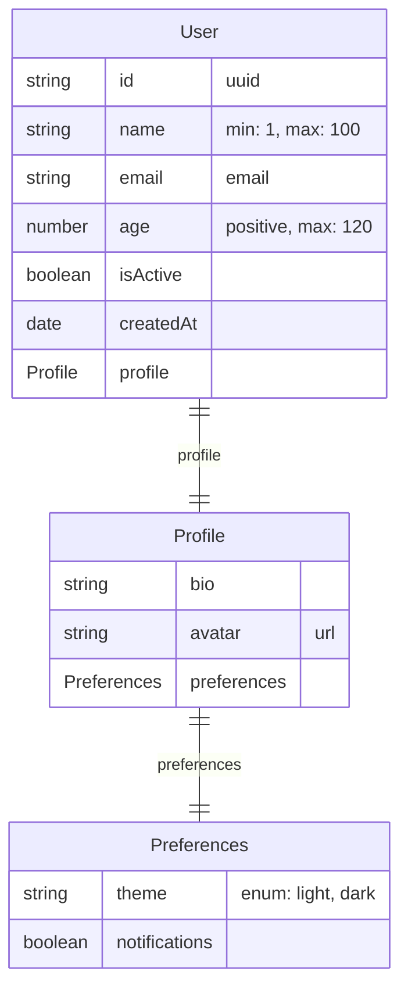

### Class Diagram
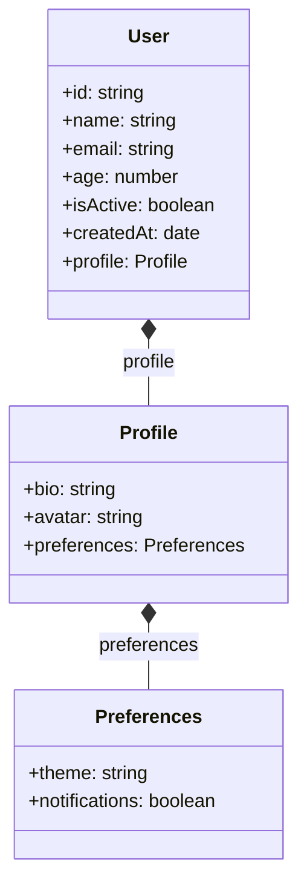

### Flowchart Diagram
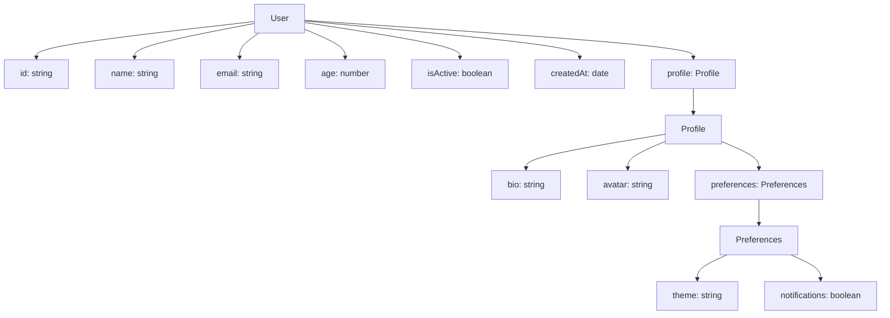

## Product Schema Example

### Entity-Relationship Diagram
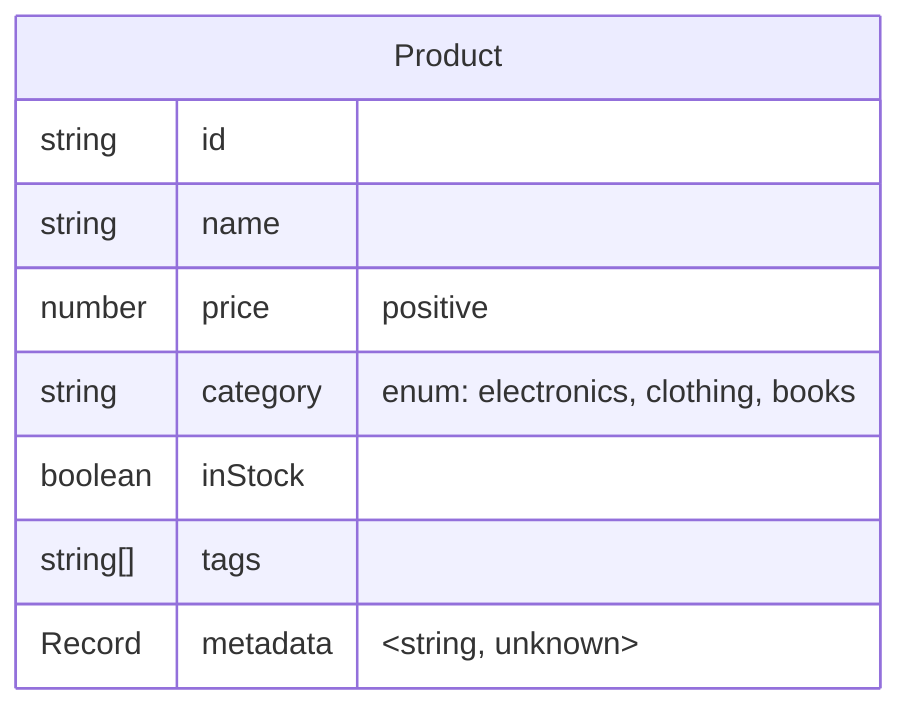

## Directory Schema Example (Self-Referential)

### Entity-Relationship Diagram
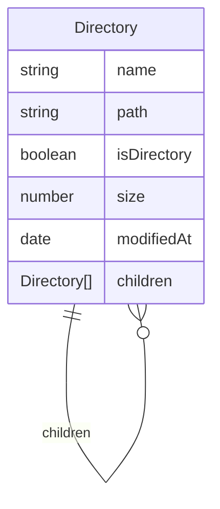

### Class Diagram
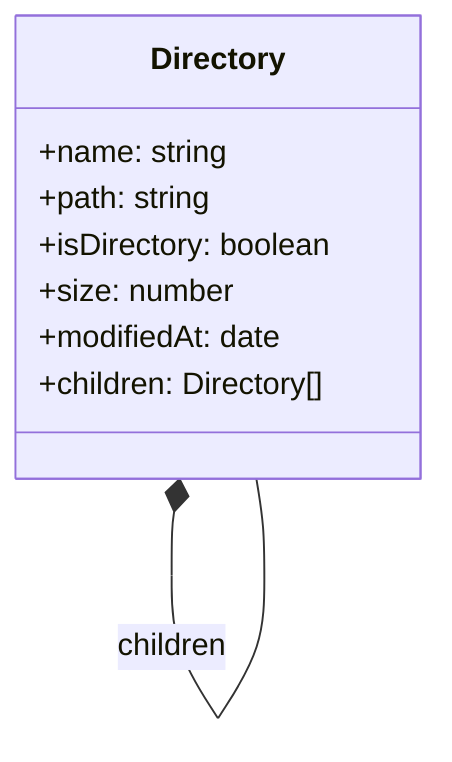

### Flowchart Diagram
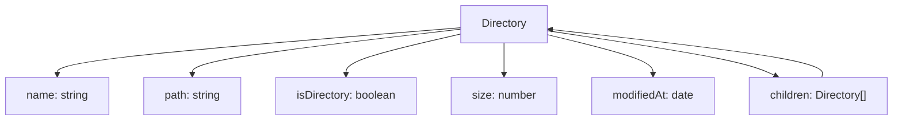

## API Response Schema Example (Discriminated Union)

### Entity-Relationship Diagram
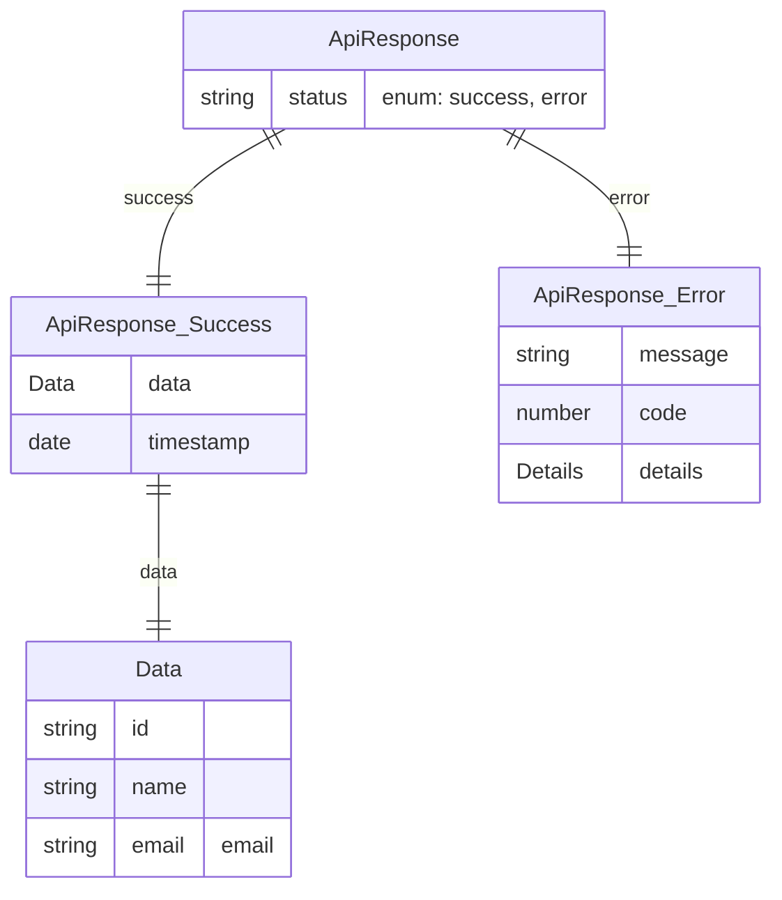

### Class Diagram
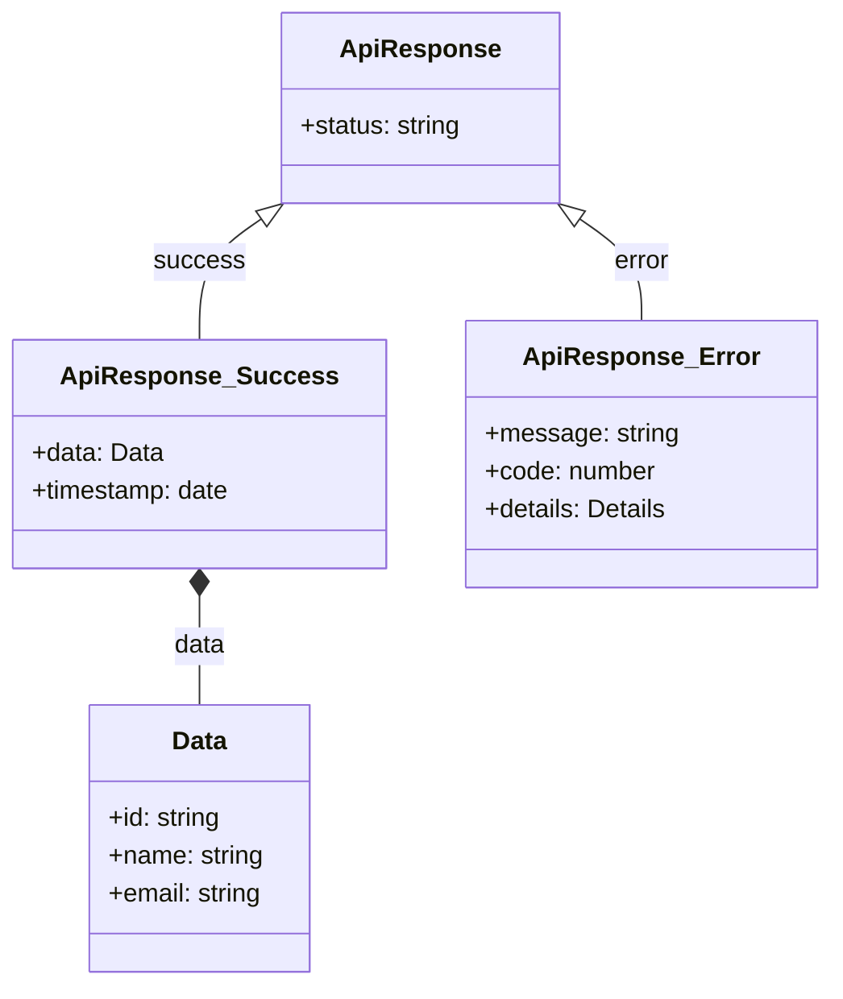

### Flowchart Diagram
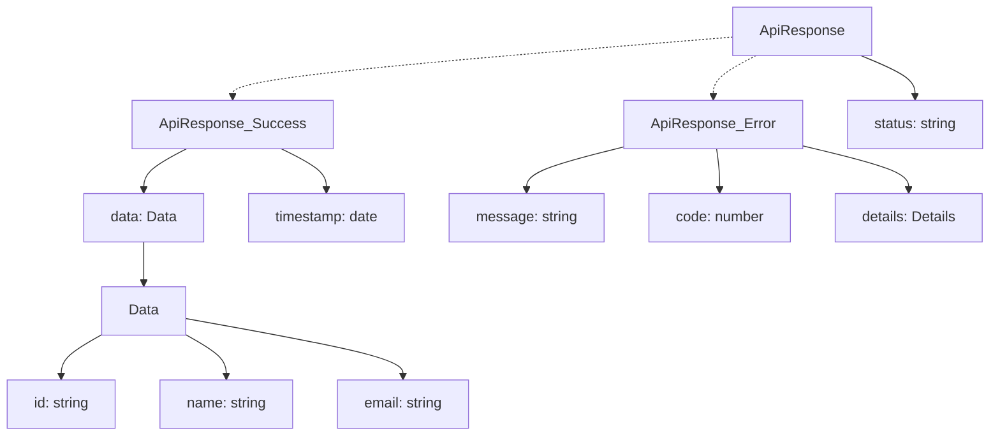

## Event Schema Example

### Entity-Relationship Diagram
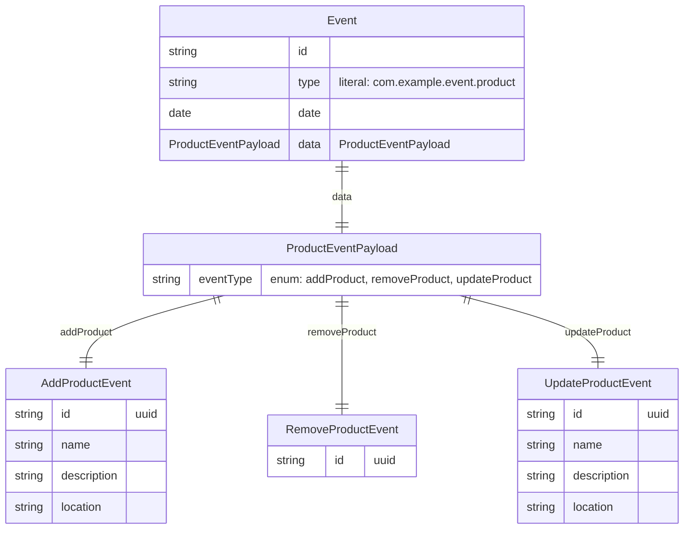

### Class Diagram
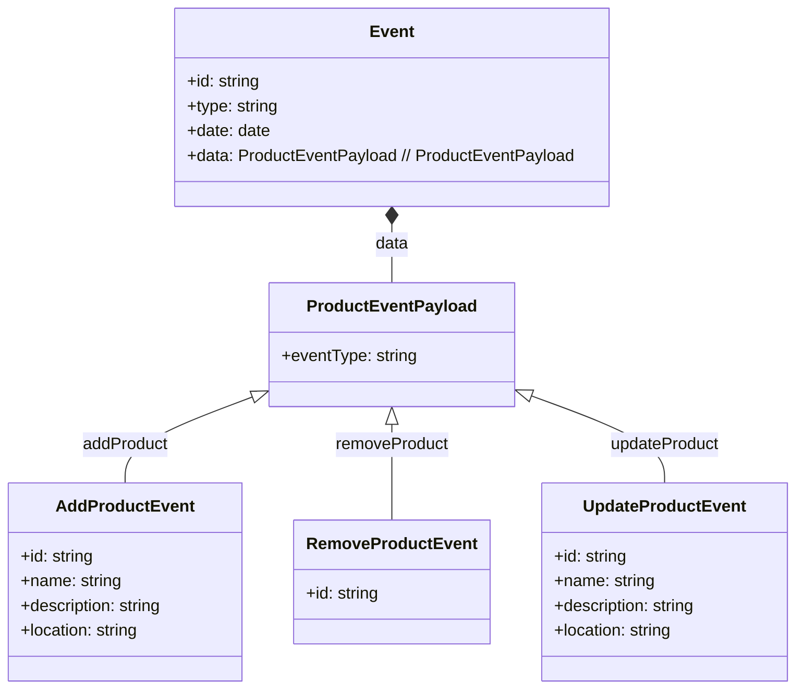

### Flowchart Diagram
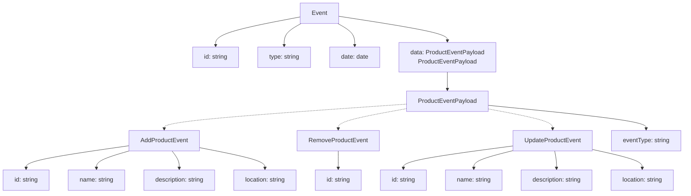

## ID Reference Schema Example

### Entity-Relationship Diagram
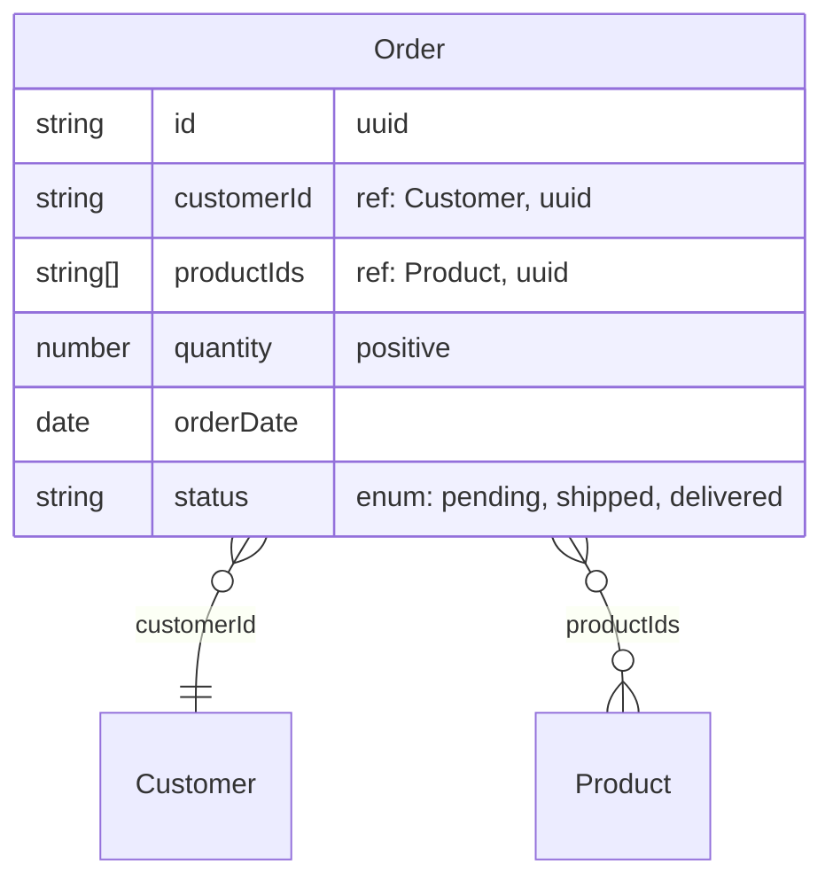

### Class Diagram
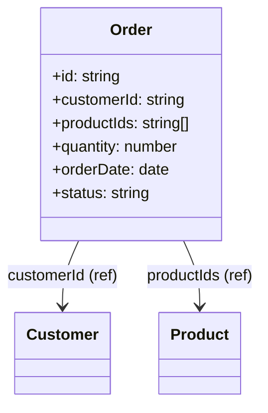

### Flowchart Diagram
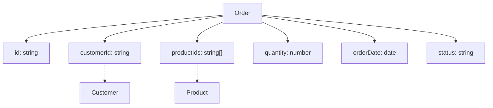

## Schema Definitions

### User Schema
```typescript
const UserSchema = z.object({
  id: z.uuid(),
  name: z.string().min(1).max(100),
  email: z.email(),
  age: z.number().min(0).max(120),
  isActive: z.boolean(),
  createdAt: z.date(),
  profile: z.object({
    bio: z.string().optional(),
    avatar: z.url().optional(),
    preferences: z.object({
      theme: z.enum(['light', 'dark']).default('light'),
      notifications: z.boolean().default(true),
    }),
  }),
}).describe('User');
```

### Product Schema
```typescript
const ProductSchema = z.object({
  id: z.string(),
  name: z.string(),
  price: z.number().positive(),
  category: z.enum(['electronics', 'clothing', 'books']),
  inStock: z.boolean(),
  tags: z.array(z.string()),
  metadata: z.record(z.string(), z.unknown()),
}).describe('Product');
```

### Directory Schema
```typescript
const DirectorySchema = z.object({
  name: z.string(),
  path: z.string(),
  isDirectory: z.boolean(),
  size: z.number().optional(),
  modifiedAt: z.date(),
  children: z.array(z.lazy(() => DirectorySchema)).optional(),
}).describe('Directory');
```

### API Response Schema (Discriminated Union)
```typescript
const ApiResponseSchema = z.discriminatedUnion('status', [
  z.object({
    status: z.literal('success'),
    data: z.object({
      id: z.string(),
      name: z.string(),
      email: z.email(),
    }),
    timestamp: z.date(),
  }).describe('ApiResponse_Success'),
  z.object({
    status: z.literal('error'),
    message: z.string(),
    code: z.number(),
    details: z.object({
      field: z.string().optional(),
      reason: z.string(),
    }).optional(),
  }).describe('ApiResponse_Error'),
]).describe('ApiResponse');
```

### Event Schema
```typescript
const ProductEventPayloadSchema = z.discriminatedUnion('eventType', [
  z.object({
    eventType: z.literal('addProduct'),
    id: z.uuid(),
    name: z.string(),
    description: z.string(),
    location: z.string(),
  }).describe('AddProductEvent'),
  z.object({
    eventType: z.literal('removeProduct'),
    id: z.uuid(),
  }).describe('RemoveProductEvent'),
  z.object({
    eventType: z.literal('updateProduct'),
    id: z.uuid(),
    name: z.string(),
    description: z.string(),
    location: z.string(),
  }).describe('UpdateProductEvent'),
]).describe('ProductEventPayload');

const EventSchema = z.object({
  id: z.string(),
  type: z.literal('com.example.event.product'),
  date: z.date(),
  data: ProductEventPayloadSchema,
}).meta({ title: 'Event', description: 'Event entity via registry meta' });
```

### ID Reference Schema
```typescript
const CustomerSchema = z.object({
  id: z.uuid(),
  name: z.string(),
  email: z.email(),
}).describe('Customer');

const ProductSchema = z.object({
  id: z.uuid(),
  name: z.string(),
  price: z.number().positive(),
  category: z.enum(['electronics', 'clothing', 'books']),
}).describe('Product');

const OrderSchema = z.object({
  id: z.uuid(),
  customerId: idRef(CustomerSchema),
  productId: idRef(ProductSchema),
  quantity: z.number().positive(),
  orderDate: z.date(),
  status: z.enum(['pending', 'shipped', 'delivered']),
}).describe('Order');
```

**Note:** The `idRef()` function creates string fields that reference other entities by ID. This allows you to show relationships without embedding the full entity structure. The library automatically generates placeholder entities and relationships for referenced entities.

## Usage

To generate your own diagrams:

```typescript
import { z } from 'zod';
import { generateMermaidDiagram } from 'zod-mermaid';

// Three ways to provide names/descriptions:
// 1) Entity name via registry meta: .meta({ title: '...' })
// 2) Fallback name via entityName option
// 3) Description via registry meta: .meta({ description: '...' })
const mySchema = z.object({
  // Your schema definition
}).meta({ title: 'MyEntity', description: 'Example entity using registry meta' });

const diagram = generateMermaidDiagram(mySchema, {
  diagramType: 'er', // 'er' | 'class' | 'flowchart'
  includeValidation: true,
  includeOptional: true,
});
```

**Note:** Entity identification precedence now is: meta.title (registry) > meta.description (registry) > `entityName` option fallback. The `.describe()` helper sets the Zod description and may also be mirrored into meta by your registry implementation, but the generator reads from the registry.
