# Zod Mermaid Examples

This document contains example Mermaid diagrams generated from Zod schemas using the zod-mermaid library.

## User Schema Examples

<!-- SCHEMA: user START -->
```typescript
const UserSchema = z.object({
  id: z.uuid(),
  name: z.string().min(1).max(100),
  email: z.email(),
  age: z.number().min(0).max(120),
  isActive: z.boolean(),
  createdAt: z.date(),
  profile: z.object({
    bio: z.string().optional(),
    avatar: z.url().optional(),
    preferences: z.object({
      theme: z.enum(['light', 'dark']).default('light'),
      notifications: z.boolean().default(true),
    }),
  }),
}).describe('User');
```
<!-- SCHEMA: user END -->

### Entity-Relationship Diagram
<!-- DIAGRAM: user-er START -->
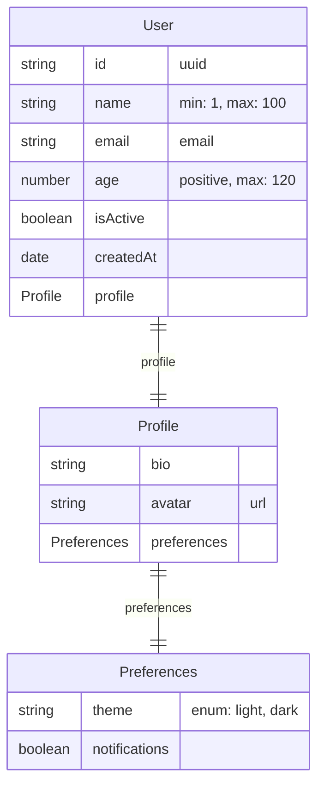
<!-- DIAGRAM: user-er END -->

### Class Diagram
<!-- DIAGRAM: user-class START -->
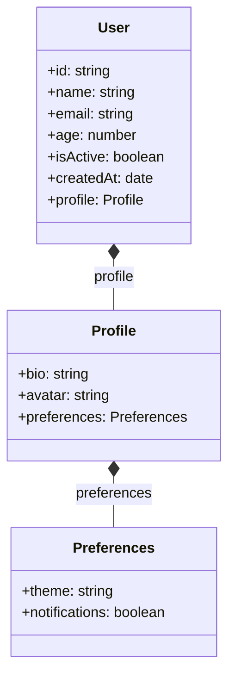
<!-- DIAGRAM: user-class END -->

### Flowchart Diagram
<!-- DIAGRAM: user-flowchart START -->
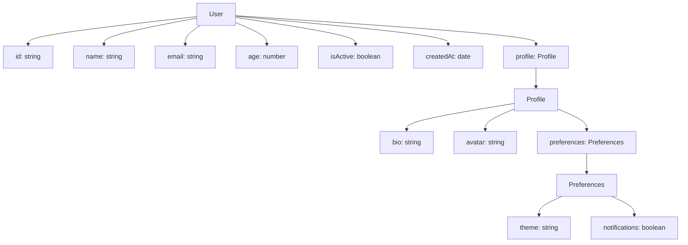
<!-- DIAGRAM: user-flowchart END -->

## Product Schema Example

<!-- SCHEMA: product START -->
```typescript
const ProductSchema = z.object({
  id: z.string(),
  name: z.string(),
  price: z.number().positive(),
  category: z.enum(['electronics', 'clothing', 'books']),
  inStock: z.boolean(),
  tags: z.array(z.string()),
  metadata: z.record(z.string(), z.unknown()),
}).describe('Product');
```
<!-- SCHEMA: product END -->

### Entity-Relationship Diagram
<!-- DIAGRAM: product-er START -->
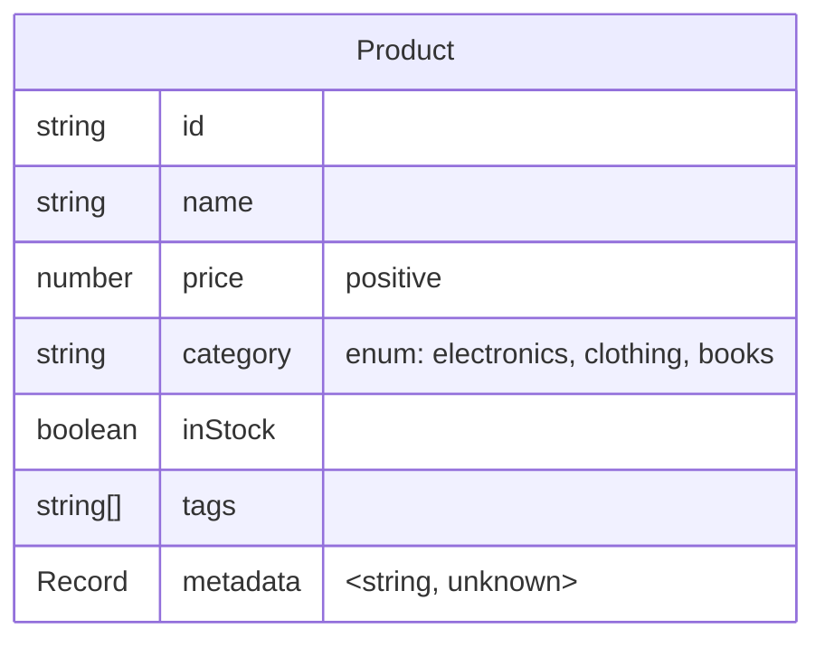
<!-- DIAGRAM: product-er END -->

## Directory Schema Example (Self-Referential)

<!-- SCHEMA: directory START -->
```typescript
const DirectorySchema: z.ZodType<any> = z.object({
  name: z.string(),
  path: z.string(),
  isDirectory: z.boolean(),
  size: z.number().optional(),
  modifiedAt: z.date(),
  children: z.array(z.lazy(() => DirectorySchema)).optional(),
}).describe('Directory');
```
<!-- SCHEMA: directory END -->

### Entity-Relationship Diagram
<!-- DIAGRAM: directory-er START -->
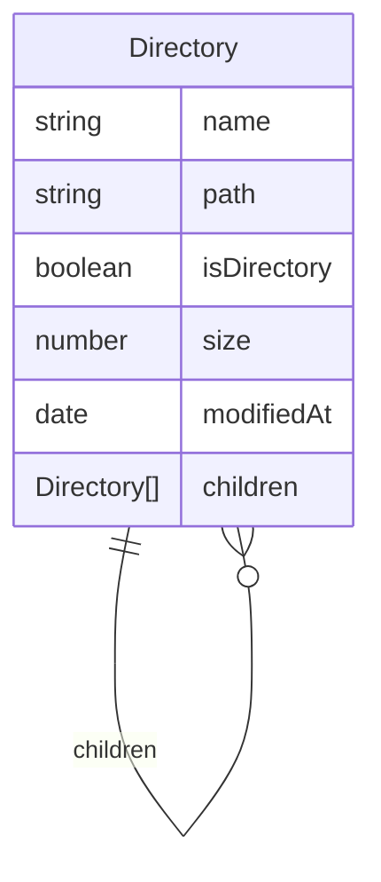
<!-- DIAGRAM: directory-er END -->

### Class Diagram
<!-- DIAGRAM: directory-class START -->
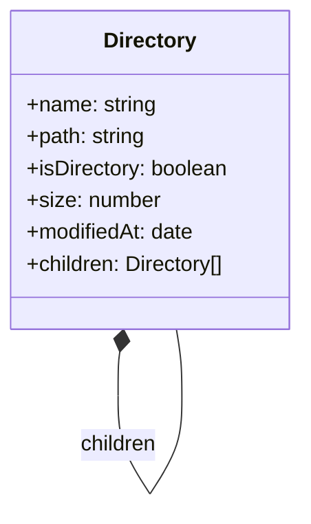
<!-- DIAGRAM: directory-class END -->

### Flowchart Diagram
<!-- DIAGRAM: directory-flowchart START -->
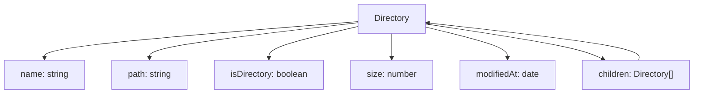
<!-- DIAGRAM: directory-flowchart END -->

## API Response Schema Example (Discriminated Union)

<!-- SCHEMA: api-response START -->
```typescript
const ApiResponseSchema = z.discriminatedUnion('status', [
  z.object({
    status: z.literal('success'),
    data: z.object({
      id: z.string(),
      name: z.string(),
      email: z.email(),
    }),
    timestamp: z.date(),
  }).describe('Success'),
  z.object({
    status: z.literal('error'),
    message: z.string(),
    code: z.number(),
    details: z.object({
      field: z.string().optional(),
      reason: z.string(),
    }).optional(),
  }).describe('Error'),
]).describe('ApiResponse');
```
<!-- SCHEMA: api-response END -->

### Entity-Relationship Diagram
<!-- DIAGRAM: api-response-er START -->
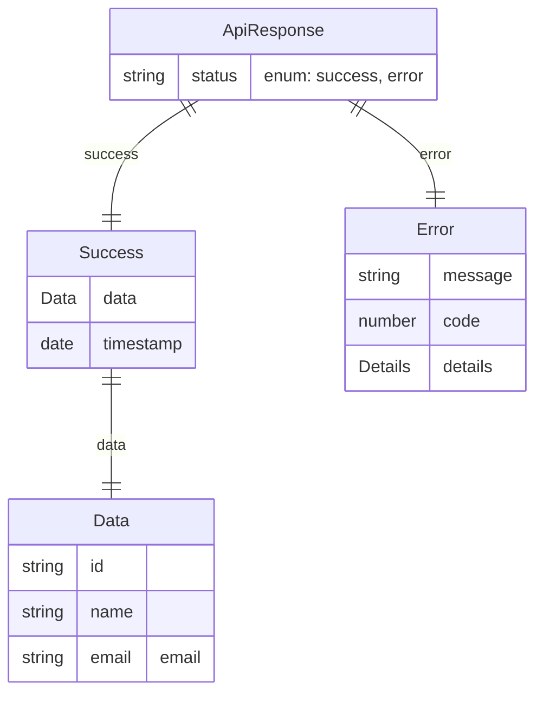
<!-- DIAGRAM: api-response-er END -->

### Class Diagram
<!-- DIAGRAM: api-response-class START -->
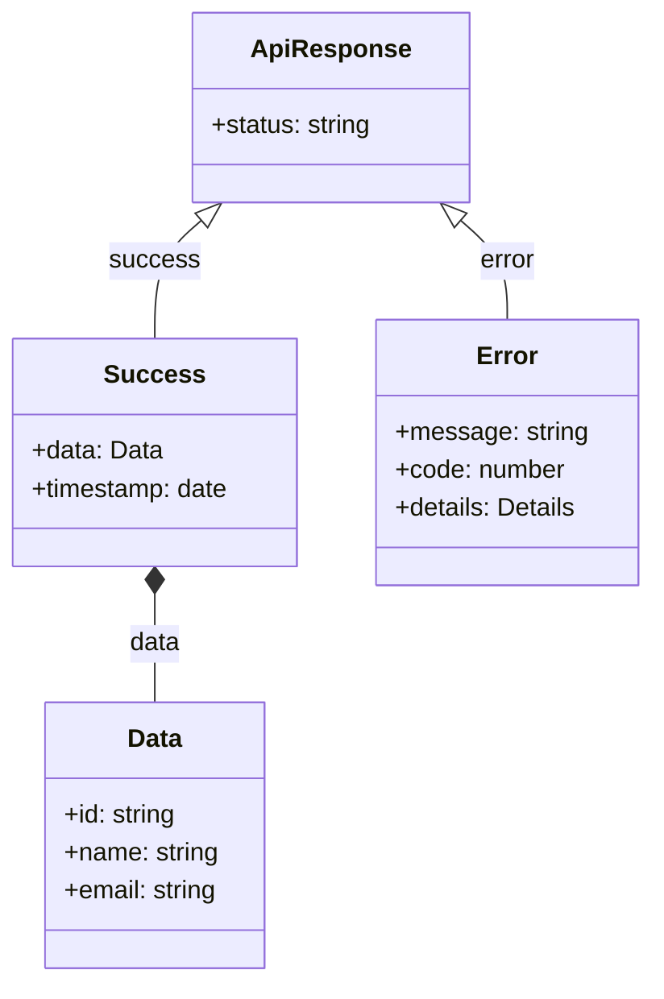
<!-- DIAGRAM: api-response-class END -->

### Flowchart Diagram
<!-- DIAGRAM: api-response-flowchart START -->
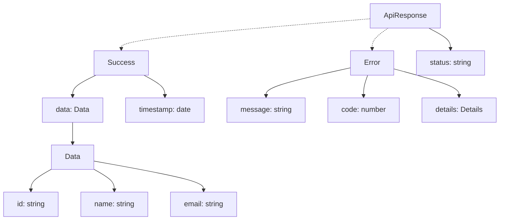
<!-- DIAGRAM: api-response-flowchart END -->

## Event Schema Example

<!-- SCHEMA: event START -->
```typescript
const ProductEventPayloadSchema = z.discriminatedUnion('eventType', [
  z.object({
    eventType: z.literal('addProduct'),
    id: z.uuid(),
    name: z.string(),
    description: z.string(),
    location: z.string(),
  }).describe('AddProductEvent'),
  z.object({
    eventType: z.literal('removeProduct'),
    id: z.uuid(),
  }).describe('RemoveProductEvent'),
  z.object({
    eventType: z.literal('updateProduct'),
    id: z.uuid(),
    name: z.string(),
    description: z.string(),
    location: z.string(),
  }).describe('UpdateProductEvent'),
]).describe('ProductEventPayload');

const EventSchema = z.object({
  id: z.string(),
  type: z.literal('com.example.event.product'),
  date: z.date(),
  data: ProductEventPayloadSchema,
}).meta({ title: 'Event', description: 'Event entity via registry meta' });
```
<!-- SCHEMA: event END -->

### Entity-Relationship Diagram
<!-- DIAGRAM: event-er START -->
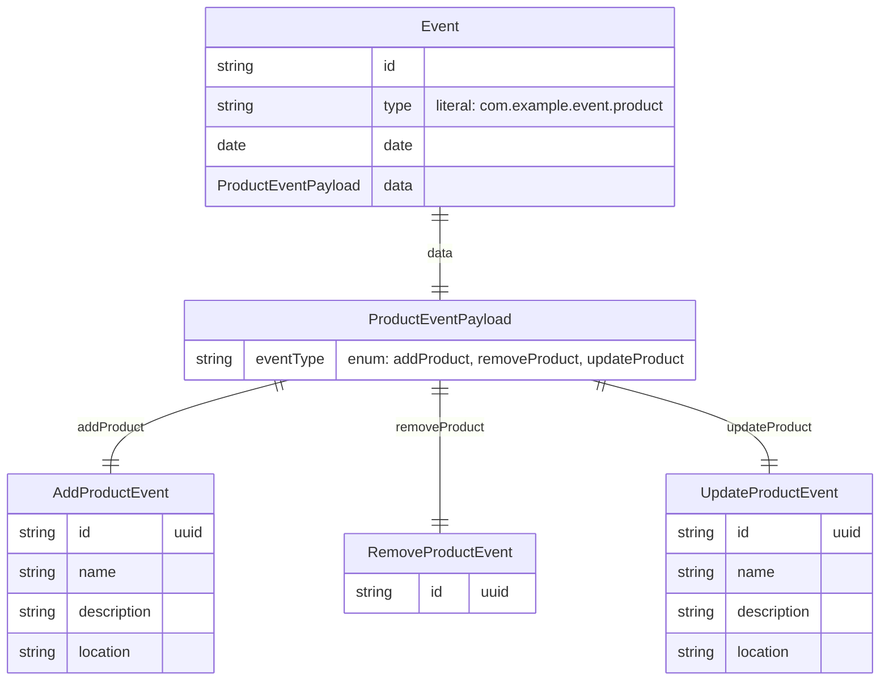
<!-- DIAGRAM: event-er END -->

### Class Diagram
<!-- DIAGRAM: event-class START -->
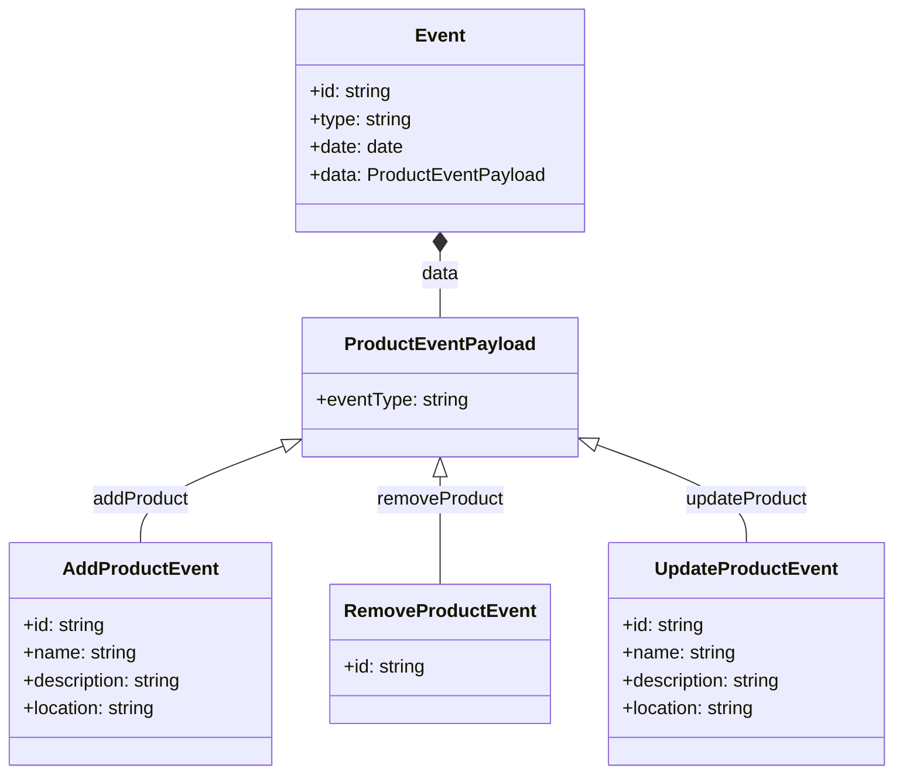
<!-- DIAGRAM: event-class END -->

### Flowchart Diagram
<!-- DIAGRAM: event-flowchart START -->
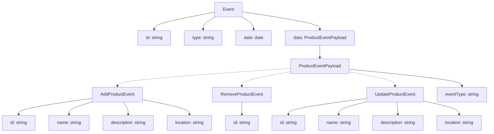
<!-- DIAGRAM: event-flowchart END -->

## Additional Types Example

<!-- SCHEMA: additional-types START -->
```typescript
const AdditionalTypesSchema = z.object({
  big: z.bigint(),
  sym: z.symbol(),
  nul: z.null(),
  und: z.undefined(),
  tup: z.tuple([z.string(), z.number(), z.boolean()]),
  map: z.map(z.string(), z.number()),
  set: z.set(z.string()),
  prom: z.promise(z.number()),
  rec: z.record(z.string(), z.number()),
  inter: z.string().and(z.number()),
  union: z.union([z.string(), z.number()]),
  key: z.keyof(z.object({ foo: z.string(), bar: z.number() })),
}).describe('AdditionalTypes');
```
<!-- SCHEMA: additional-types END -->

### Entity-Relationship Diagram
<!-- DIAGRAM: additional-types-er START -->
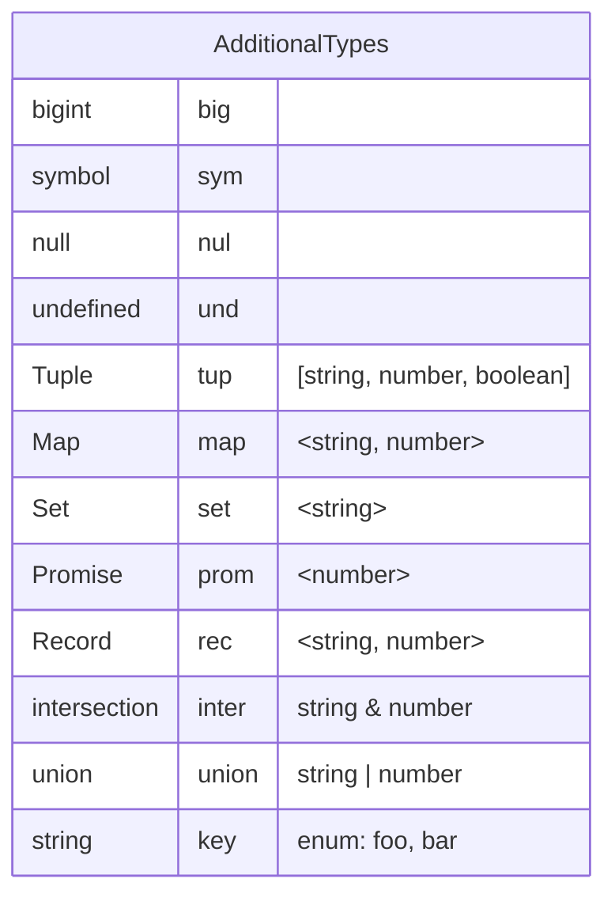
<!-- DIAGRAM: additional-types-er END -->

### Class Diagram
<!-- DIAGRAM: additional-types-class START -->
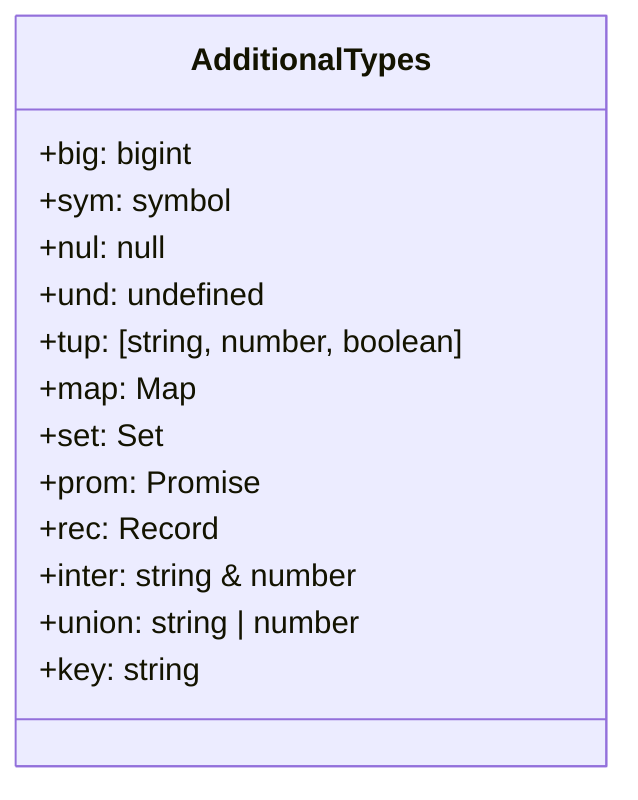
<!-- DIAGRAM: additional-types-class END -->

### Flowchart Diagram
<!-- DIAGRAM: additional-types-flowchart START -->
```mermaid
flowchart TD
    AdditionalTypes["AdditionalTypes"]
    AdditionalTypes_big["big: bigint"]
    AdditionalTypes --> AdditionalTypes_big["big: bigint"]
    AdditionalTypes_sym["sym: symbol"]
    AdditionalTypes --> AdditionalTypes_sym["sym: symbol"]
    AdditionalTypes_nul["nul: null"]
    AdditionalTypes --> AdditionalTypes_nul["nul: null"]
    AdditionalTypes_und["und: undefined"]
    AdditionalTypes --> AdditionalTypes_und["und: undefined"]
    AdditionalTypes_tup["tup: [string, number, boolean]"]
    AdditionalTypes --> AdditionalTypes_tup["tup: [string, number, boolean]"]
    AdditionalTypes_map["map: Map<string, number>"]
    AdditionalTypes --> AdditionalTypes_map["map: Map<string, number>"]
    AdditionalTypes_set["set: Set<string>"]
    AdditionalTypes --> AdditionalTypes_set["set: Set<string>"]
    AdditionalTypes_prom["prom: Promise<number>"]
    AdditionalTypes --> AdditionalTypes_prom["prom: Promise<number>"]
    AdditionalTypes_rec["rec: Record<string, number>"]
    AdditionalTypes --> AdditionalTypes_rec["rec: Record<string, number>"]
    AdditionalTypes_inter["inter: string & number"]
    AdditionalTypes --> AdditionalTypes_inter["inter: string & number"]
    AdditionalTypes_union["union: string | number"]
    AdditionalTypes --> AdditionalTypes_union["union: string | number"]
    AdditionalTypes_key["key: string"]
    AdditionalTypes --> AdditionalTypes_key["key: string"]
```
<!-- DIAGRAM: additional-types-flowchart END -->

## ID Reference Schema Example

<!-- SCHEMA: id-ref START -->
```typescript
const CustomerSchema = z.object({
  id: z.uuid(),
}).describe('Customer');

const ProductRefSchema = z.object({
  id: z.uuid(),
}).describe('Product');

const OrderSchema = z.object({
  id: z.uuid(),
  customerId: idRef(CustomerSchema),
  productIds: z.array(idRef(ProductRefSchema)),
  quantity: z.number().positive(),
  orderDate: z.date(),
  status: z.enum(['pending', 'shipped', 'delivered']),
}).describe('Order');
```
<!-- SCHEMA: id-ref END -->

### Entity-Relationship Diagram
<!-- DIAGRAM: id-ref-er START -->
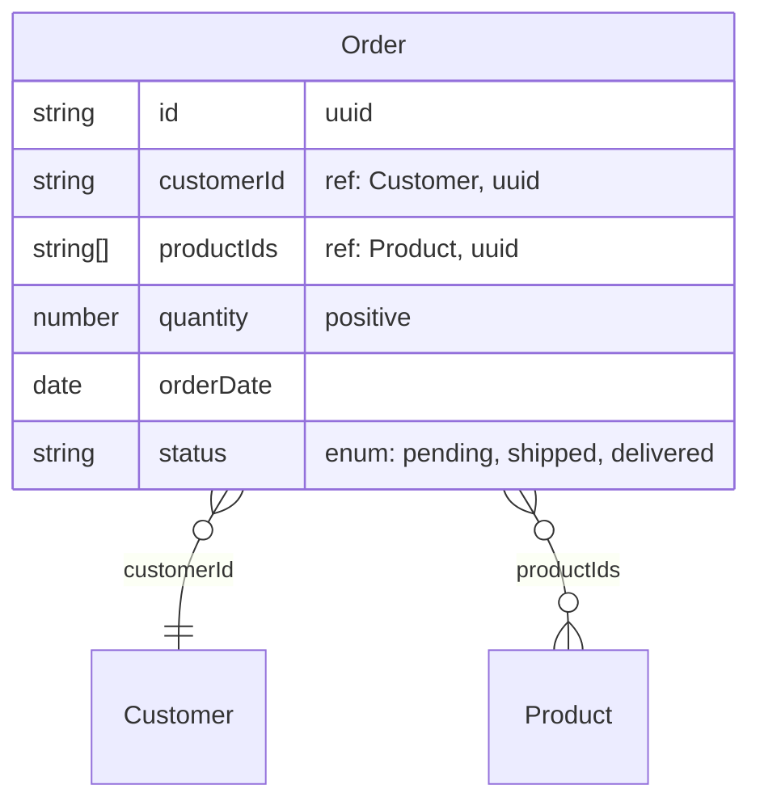
<!-- DIAGRAM: id-ref-er END -->

### Class Diagram
<!-- DIAGRAM: id-ref-class START -->
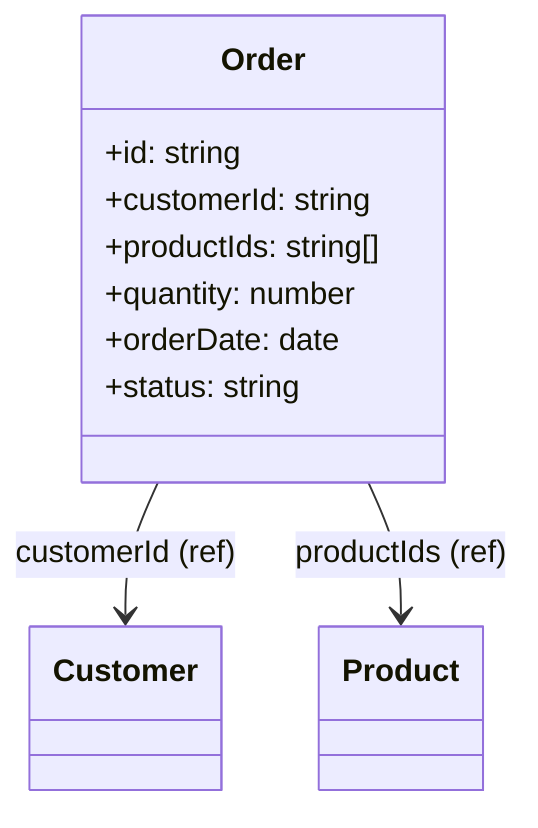
<!-- DIAGRAM: id-ref-class END -->

### Flowchart Diagram
<!-- DIAGRAM: id-ref-flowchart START -->
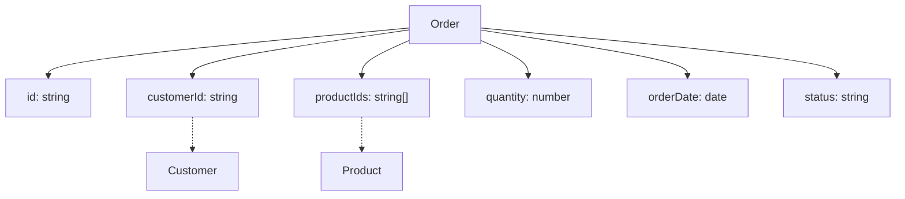
<!-- DIAGRAM: id-ref-flowchart END -->

## Usage

To generate your own diagrams:

```typescript
import { z } from 'zod';
import { generateMermaidDiagram } from 'zod-mermaid';

// Use .describe() to provide entity names
const mySchema = z.object({
  // Your schema definition
}).describe('MyEntity');

const diagram = generateMermaidDiagram(mySchema, {
  diagramType: 'er', // 'er' | 'class' | 'flowchart'
  includeValidation: true,
  includeOptional: true,
});
```

**Note:** The library automatically uses the schema title (set with `.meta({title})` 
or description (set with `.describe()`) as the entity name. If no title or description 
is provided, it will use the `entityName` option or default to 'Schema'.
