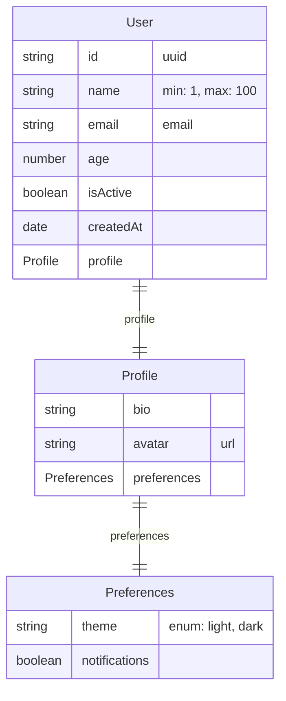
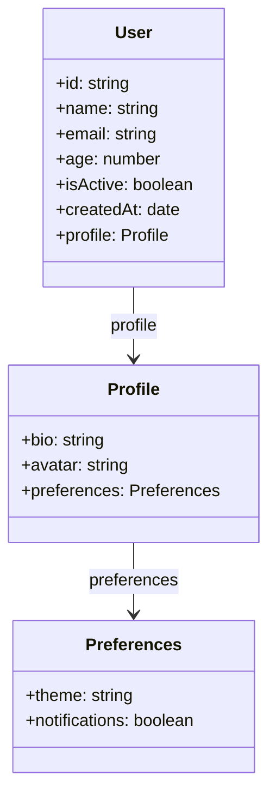
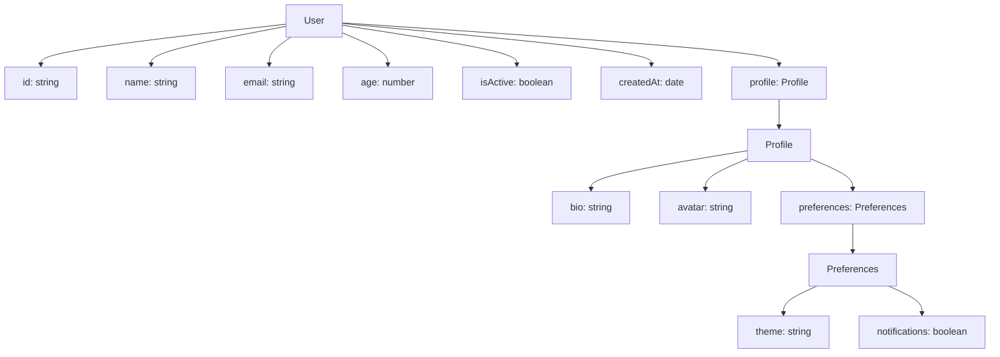
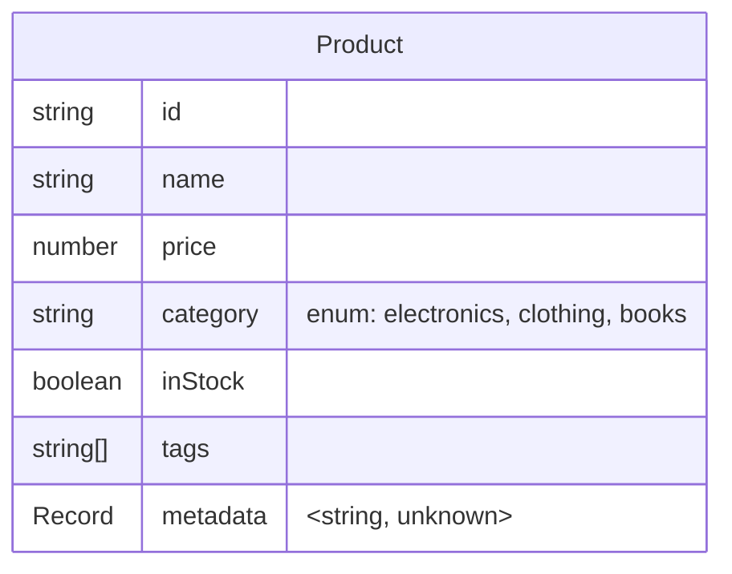
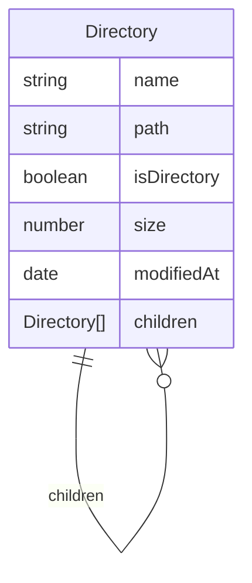
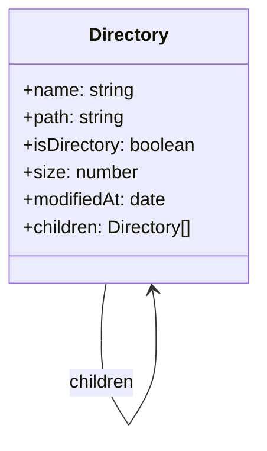
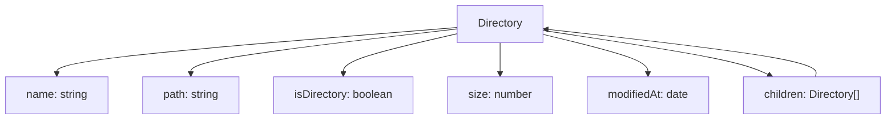

# Zod Mermaid Examples

This document contains example Mermaid diagrams generated from Zod schemas using the zod-mermaid library.

## User Schema Examples

### Entity-Relationship Diagram


### Class Diagram


### Flowchart Diagram


## Product Schema Example

### Entity-Relationship Diagram


## Directory Schema Example (Self-Referential)

### Entity-Relationship Diagram


### Class Diagram


### Flowchart Diagram


## Schema Definitions

### User Schema
```typescript
const UserSchema = z.object({
  id: z.uuid(),
  name: z.string().min(1).max(100),
  email: z.email(),
  age: z.number().min(0).max(120),
  isActive: z.boolean(),
  createdAt: z.date(),
  profile: z.object({
    bio: z.string().optional(),
    avatar: z.url().optional(),
    preferences: z.object({
      theme: z.enum(['light', 'dark']).default('light'),
      notifications: z.boolean().default(true),
    }),
  }),
}).describe('User');
```

### Product Schema
```typescript
const ProductSchema = z.object({
  id: z.string(),
  name: z.string(),
  price: z.number().positive(),
  category: z.enum(['electronics', 'clothing', 'books']),
  inStock: z.boolean(),
  tags: z.array(z.string()),
  metadata: z.record(z.string(), z.unknown()),
}).describe('Product');
```

### Directory Schema
```typescript
const DirectorySchema = z.object({
  name: z.string(),
  path: z.string(),
  isDirectory: z.boolean(),
  size: z.number().optional(),
  modifiedAt: z.date(),
  children: z.array(z.lazy(() => DirectorySchema)).optional(),
}).describe('Directory');
```

## Usage

To generate your own diagrams:

```typescript
import { z } from 'zod';
import { generateMermaidDiagram } from 'zod-mermaid';

// Use .describe() to provide entity names
const mySchema = z.object({
  // Your schema definition
}).describe('MyEntity');

const diagram = generateMermaidDiagram(mySchema, {
  diagramType: 'er', // 'er' | 'class' | 'flowchart'
  includeValidation: true,
  includeOptional: true,
});
```

**Note:** The library automatically uses the schema description (set with `.describe()`) as the entity name. If no description is provided, it will use the `entityName` option or default to 'Schema'.
