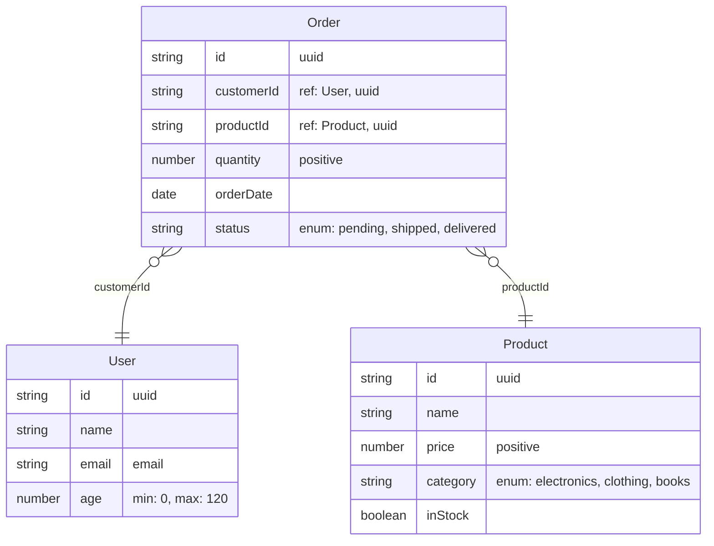
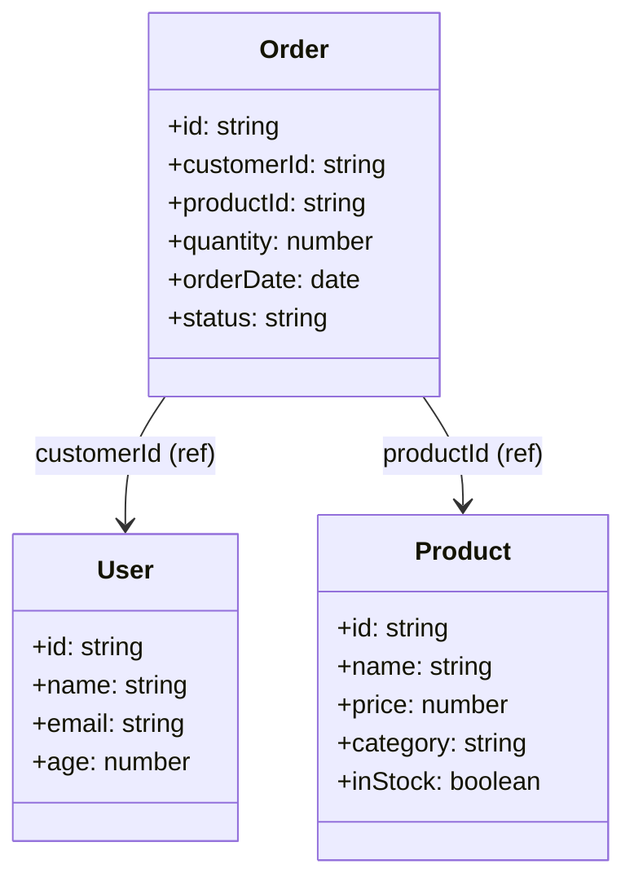
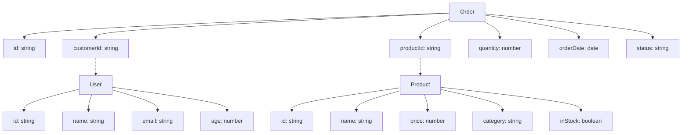

# Multiple Schemas Example

This example demonstrates how to generate Mermaid diagrams from multiple Zod schemas at once.

## Basic Example

```typescript
import { z } from 'zod';
import { generateMermaidDiagram, idRef } from 'zod-mermaid';

// Define multiple schemas
const UserSchema = z.object({
  id: z.uuid(),
  name: z.string(),
  email: z.email(),
  age: z.number().min(0).max(120),
}).describe('User');

const ProductSchema = z.object({
  id: z.uuid(),
  name: z.string(),
  price: z.number().positive(),
  category: z.enum(['electronics', 'clothing', 'books']),
  inStock: z.boolean(),
}).describe('Product');

const OrderSchema = z.object({
  id: z.uuid(),
  customerId: idRef(UserSchema),
  productId: idRef(ProductSchema),
  quantity: z.number().positive(),
  orderDate: z.date(),
  status: z.enum(['pending', 'shipped', 'delivered']),
}).describe('Order');

// Generate diagram from multiple schemas
const diagram = generateMermaidDiagram([UserSchema, ProductSchema, OrderSchema], {
  diagramType: 'er',
});
```

## Generated ER Diagram



## Class Diagram Example

```typescript
const classDiagram = generateMermaidDiagram([UserSchema, ProductSchema, OrderSchema], {
  diagramType: 'class',
});
```



## Flowchart Example

```typescript
const flowchartDiagram = generateMermaidDiagram([UserSchema, ProductSchema, OrderSchema], {
  diagramType: 'flowchart',
});
```



## Benefits of Multiple Schemas

1. **Single Diagram**: Generate one comprehensive diagram showing all entities and their relationships
2. **Cross-Schema Relationships**: Show relationships between entities defined in different schemas
3. **Consistent Styling**: All entities use the same diagram styling and options
4. **Reduced Complexity**: No need to manually combine diagrams or manage multiple files

## Usage Patterns

### Single Schema (Backward Compatible)
```typescript
const diagram = generateMermaidDiagram(UserSchema, { diagramType: 'er' });
```

### Multiple Schemas
```typescript
const diagram = generateMermaidDiagram([UserSchema, ProductSchema], { diagramType: 'er' });
```

### Empty Array
```typescript
const diagram = generateMermaidDiagram([], { diagramType: 'er' });
// Returns: "erDiagram"
```

## Suggested usage

1. **Use Descriptive Names**: Use `.describe()` or `.meta({title})` on your schemas to provide meaningful entity names
2. **Group Related Schemas**: Pass schemas that are related or part of the same domain together
3. **Consider Diagram Size**: Very large diagrams with many entities may become hard to read
4. **Use ID References**: Use `idRef()` to create relationships between schemas without embedding full structures 